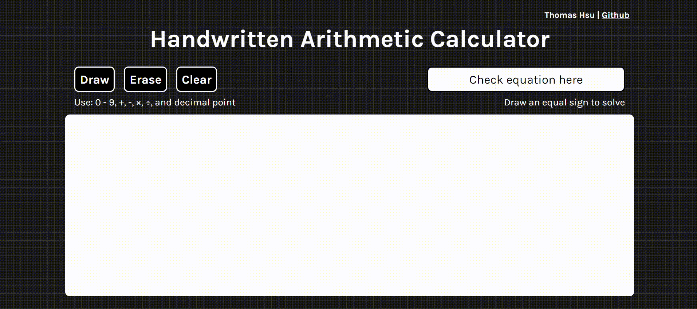

<h1> Handwritten Arithmetic Calculator </h1>
A calculator that automatically solves a handwritten arithmetic expression

<h2>Technologies Used</h2>
<ul>
  <li> Convolutional Neural Network created with PyTorch </li>
  <li> OCR segmentation done with CV2 </li>
  <li> Dataset provided by <a href="https://www.kaggle.com/datasets/sagyamthapa/handwritten-math-symbols">Handwritten Math Symbols - Sagyam Thapa</a> </li>
</ul>

<h2>Features</h2>
<ul>
  <li> Users can write out an expression on a canvas element </li>
  <li> To solve the expression, users can write an equal sign, and the solution will appear next to it </li>
  <li> Users also have the ability to erase and clear the canvas </li>
  <li> Changes to the expression are reflected in real time </li>
</ul>

<h2>Future Implementation Goals</h2>
<ul>
  <li> Ability to handle multiple expressions (Current version can only handle one equation) </li>
  <li> Needs error handling </li>

</ul>

<h2>Note</h2>
  <li> No mobile view support </li>
  <li> Answer will not appear next to equal sign if window is less than canvas width </li>
  <li> For demonstration purposes, this current version uses eval(), which may output inaccuracies </li>